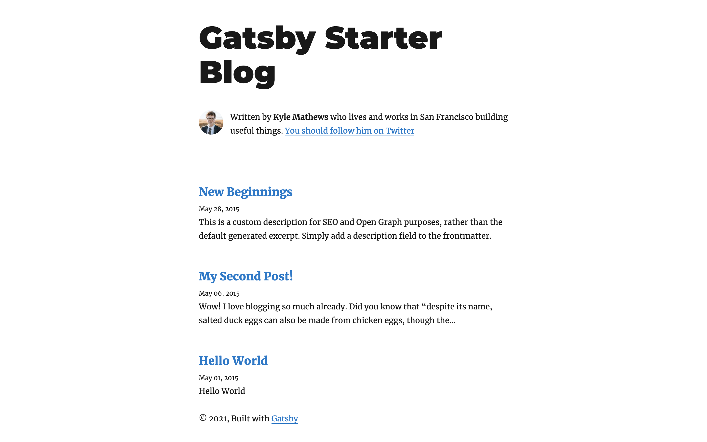
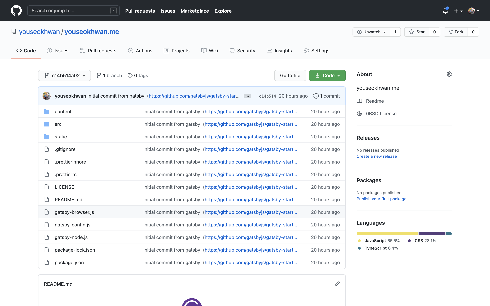
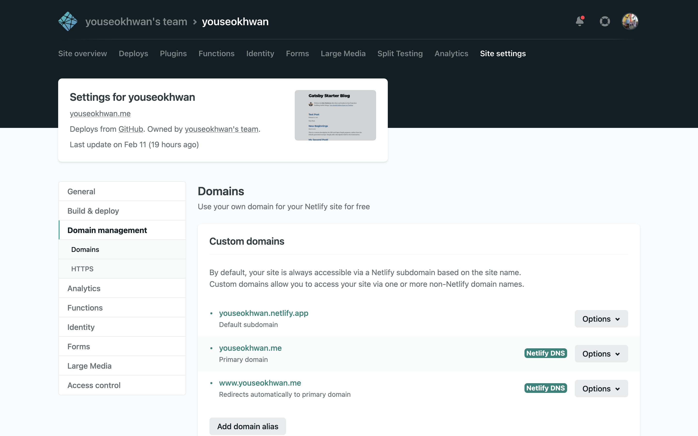
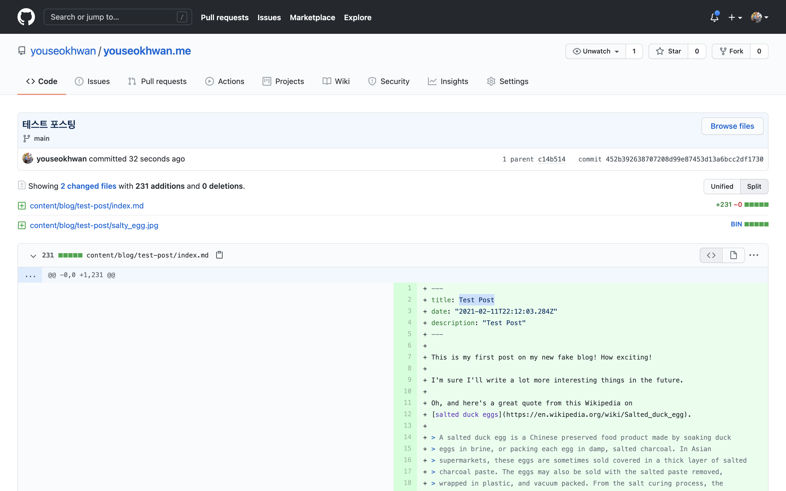
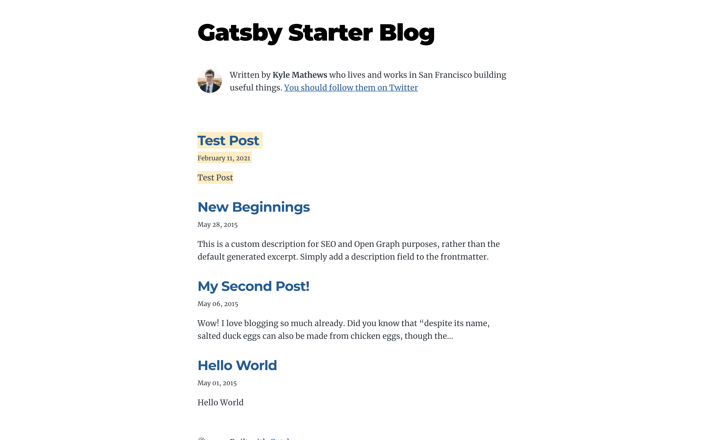

세련된 기술 블로그를 운영하는 것은 나를 포함한 많은 개발자들의 목표일 것이다.

목표를 실현하기 위해 여러 플랫폼을 사용해봤으나 어딘가 하나씩 마음에 들지 않았다.

그래서 자유롭게 커스텀 할 수 있는 GitHub Blog를 선택하게 되었다.

## Gatsby

먼저, 정적 사이트 생성기인 Gatsby를 이용해 블로그를 생성했다.

Gatsby는 여러 가지 템플릿을 제공하는데 그중 gatsby-starter-blog를 선택하였다.

디자인이 마음에 들어서 선택했다기보다는 가장 기본적인 테마에서 직접 수정해나갈 생각으로 선택했다.

[이 포스팅](https://medium.com/@sjoonk/gatsby-blog-%ED%85%8C%EB%A7%88%EB%A1%9C-%EC%B4%88%EA%B0%84%EB%8B%A8-%EB%B8%94%EB%A1%9C%EA%B7%B8-%EB%A7%8C%EB%93%A4%EA%B8%B0-af20b6eb408f)을 참고하여 repository를 생성하고 자동 생성된 파일들을 연결하여 커밋하였다.

## 도메인 구매

사실 개인 도메인이 꼭 필요하지는 않다.

호스팅 서비스를 이용하면 youseokhwan.netlify.app 혹은 youseokhwan.github.io 등의 도메인을 사용할 수 있기 때문이다.

그러나 개인 도메인을 구매하면 youseokhwan.me처럼 내가 원하는 도메인을 사용할 수 있다.

'나만의 사이트'를 운영하면서 상당한 자기만족을 얻을 수 있다.

또한, 방문자들에게도 좋은 첫인상을 심어줄 수 있다고 생각한다.

이전에 가비아에서 사둔 도메인을 사용할 예정이고, 이후 설정은 Netlify를 연결한 후 진행한다.

## Netlify

웹 사이트 호스팅을 위해 Netlify를 사용하였다.

[이 포스팅](https://anpigon.github.io/blog/kr/@anpigon/netlify-gatsby--1545785934223/)을 참고하여 어렵지 않게 호스팅에 성공하였다.

[youseokhwan.netlify.app](https://youseokhwan.netlify.app/)에 접속되는 것을 확인하고 도메인 연결을 진행하였다.

Custom domain을 추가하고 Netlify에서 제공하는 네임서버 정보를 가비아 설정에 적용하면 된다.

적용되는데 하루 정도 걸린다고 쓰여있으나 30분 후에 [youseokhwan.me](https://youseokhwan.me/)에 접속되는 것을 확인했다.

## 테스트 포스팅

잘 적용되는지 확인하기 위해 포스트를 하나 작성해보도록 하겠다.

gatsby-starter-blog 테마의 경우 content/blog/ 경로에 새 글을 작성하면 된다.

기존 포스트를 복사해서 title만 'Test Post'로 변경하여 커밋하였다.

푸시하고 30초 정도 기다리니 자동으로 배포가 되었다.

이것으로 블로그 구축의 첫발을 내디뎠다.

뿌듯했지만, 이 상태는 내가 원하는 블로그의 모습이 아니므로 계속해서 수정해나갈 계획이다.

## 참고

1. [https://www.gatsbyjs.com/starters/gatsbyjs/gatsby-starter-blog](https://www.gatsbyjs.com/starters/gatsbyjs/gatsby-starter-blog)
2. [https://medium.com/@sjoonk/gatsby-blog-테마로-초간단-블로그-만들기-af20b6eb408f](https://medium.com/@sjoonk/gatsby-blog-%ED%85%8C%EB%A7%88%EB%A1%9C-%EC%B4%88%EA%B0%84%EB%8B%A8-%EB%B8%94%EB%A1%9C%EA%B7%B8-%EB%A7%8C%EB%93%A4%EA%B8%B0-af20b6eb408f)
3. [https://anpigon.github.io/blog/kr/@anpigon/netlify-gatsby--1545785934223/](https://anpigon.github.io/blog/kr/@anpigon/netlify-gatsby--1545785934223/)
